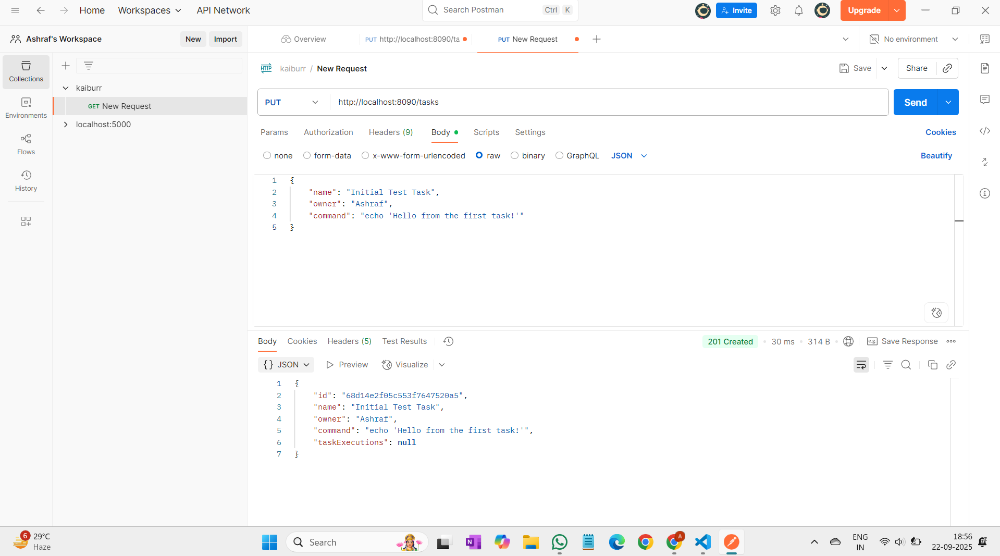
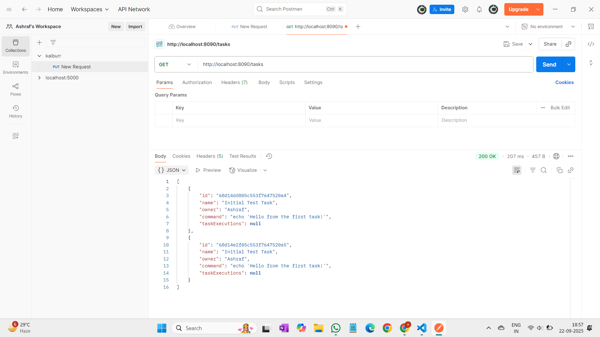
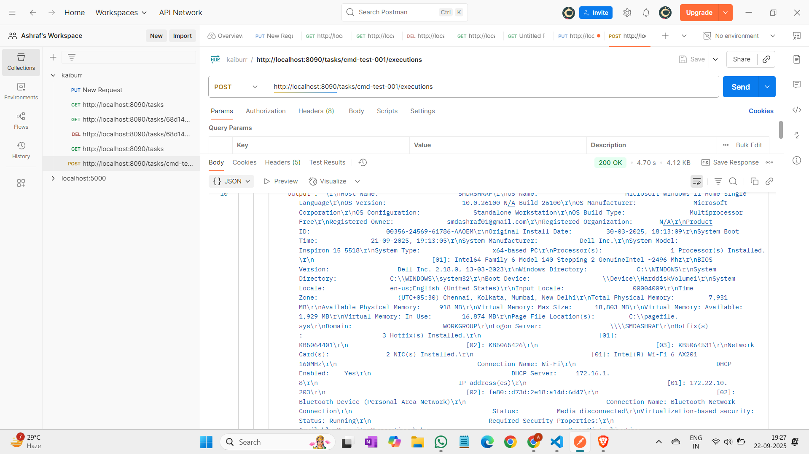
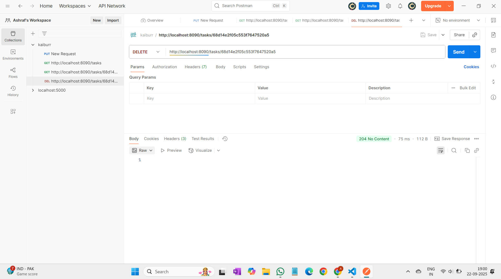
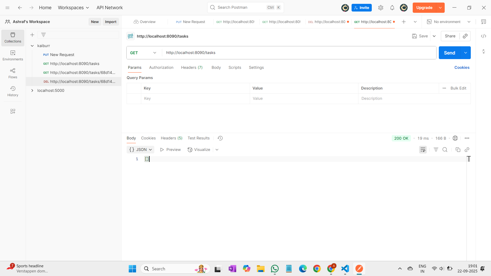

# Kaiburr Technical Assessment - Task 1: Java Backend REST API

This repository contains the solution for **Task 1** of the Kaiburr technical assessment. It is a fully functional RESTful API built with Java and the Spring Boot framework that allows for creating, searching, deleting, and executing shell command "tasks". The application uses MongoDB as its persistence layer.

---

## 🚀 Features

- **Full CRUD Operations:** Comprehensive Create, Read, Update, and Delete functionality for "Task" objects.
- **Dynamic Substring Search:** An endpoint to search for tasks where the name *contains* a given string.
- **Remote Command Execution:** A dedicated endpoint to securely execute the shell command associated with a task and record the timestamped output.
- **Embedded Document Model:** Task execution history is efficiently stored as an embedded list within each parent task document in MongoDB.
- **RESTful Architecture:** The API adheres to standard REST principles, including the proper use of HTTP methods (`PUT`, `GET`, `POST`, `DELETE`) and HTTP status codes (`200 OK`, `201 Created`, `204 No Content`, `404 Not Found`).

---

## 🛠️ Technology Stack

- **Language:** Java 17
- **Framework:** Spring Boot 3
- **Database:** MongoDB
- **Build & Dependency Management:** Apache Maven
- **Core Dependencies:**
  - `spring-boot-starter-web`: For building RESTful web services with an embedded Tomcat server.
  - `spring-boot-starter-data-mongodb`: For elegant and powerful data access to MongoDB.
  - `lombok`: To significantly reduce boilerplate code in model classes.

---

## 📋 Prerequisites

To build and run this application locally, you will need the following software installed and configured:

- **Java Development Kit (JDK) v17** or later.
- **Apache Maven**.
- **MongoDB Community Server** (running on the default port `27017`).
- An API client such as **Postman** for testing the endpoints.

---

## ⚙️ How to Compile and Run

1.  **Clone the repository:**

    ```bash
    git clone https://github.com/Ashraf0705/kaiburr-task1-java-api.git
    cd kaiburr-task1-java-api
    ```

2.  **Compile and package the application using the Maven Wrapper:**

    The Maven Wrapper (`mvnw`) included in the repository ensures a consistent build environment.

    ```bash
    # For Windows
    ./mvnw.cmd clean package

    # For macOS/Linux
    ./mvnw clean package
    ```

    This command will compile the source code and package the application into a single executable `.jar` file located in the `/target` directory.

3.  **Run the application:**

    ```bash
    java -jar target/task-api-0.0.1-SNAPSHOT.jar
    ```

    The server will start on port **`8090`**. The API base URL is `http://localhost:8090`.

---

## 🧪 API Endpoints & Usage Guide

The following is a demonstration of the API's core functionalities using Postman.

### 1. Create a Task

*   **Method:** `PUT`
*   **URL:** `http://localhost:8090/tasks`

**Example Request Body:**
```json
{
    "name": "System Info Task",
    "owner": "Ashraf",
    "command": "systeminfo"
}
```
**Screenshot of Successful Creation:**

<p align="center">
  
</p>

---

### 2. Get All Tasks

- **Method:** `GET`  
- **URL:** `http://localhost:8090/tasks`

**Screenshot of Fetching All Tasks:**

<p align="center">
  
</p>

---

### 3. Execute a Task's Command

- **Method:** `POST`  
- **URL:** `http://localhost:8090/tasks/{taskId}/executions`  
  *(Replace `{taskId}` with the actual ID from the previous step)*

**Screenshot of Successful Command Execution:**

<p align="center">
  
</p>

---

### 4. Delete a Task (and Verify)

- **Method:** `DELETE`  
- **URL:** `http://localhost:8090/tasks/{taskId}`

**Screenshot of Successful Deletion (Verified):**

<p align="center">
  
</p>

---

### 5. Get All Tasks (Final Verification)

After deleting, you can run `GET /tasks` again to confirm no tasks remain.

**Final Verification Screenshot:**

<p align="center">
  
</p>

